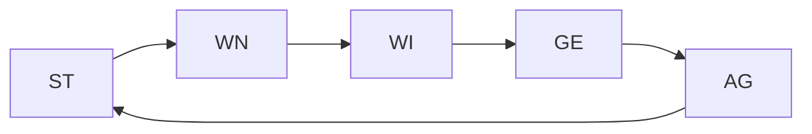

# Charakter
## Eigenschaften
#### Agilität (AG)
Wie gut kannst du dich körperlich bewegen?
:LiArrowBigRightDash: Bewegung BW
#### Stärke (ST)
Wie gut kannst du schwere Dinge heben?
:LiArrowBigRightDash: Kontrolle/CC (wie gut Entitäten kontrollieren)
#### Geschick (GE)
Wie gut kannst du mit den Händen umgehen?
:LiArrowBigRightDash: Schwierigkeit (wie schwer wird Ziel getroffen)
#### Wissen (WI)
Wie viel weißt du?
#### Wahrnehmung (WN)
Wie gut sind deine Sinne?
#### Charisma (CH)
Wie gut kannst du mit Lebewesen umgehen?
#### Lebenspunkte (LP)
Wie gut ist deine Verfassung?
## Beispielwerte
2 — Untergrenze
4 — Unbeholfen
8 — Durchschnitt
10 — Anfänger
13 — Fortgeschritten
16 — Experte
18 — Obergrenze
# Bewegung
## Distanzmessung
In Zoll oder Hexagons, vom vorderen Ende bis zum vorderen Ende der Base gemessen; Fernkampf/AoE trifft, sobald Base teilweise innerhalb der Messung ist; Bewegung ist nur durch Gänge, die breiter als Base sind möglich (meist ~1").
1 Zoll = 1 Meter
## Bewegung (BW)
Wie weit eine Entität sich in einer Ak bewegen kann.

| AG (jeden 2.) | Reichweite in Zoll " (x+4) |
| ------------- | -------------------------- |
| 2-3           | 4                          |
| 5-6           | 5                          |
| 7-8           | 6                          |
| 9-10          | 7                          |
| 11-12         | 8                          |
| 13-14         | 9                          |
| 15-16         | 10                         |
| 17-18         | 11                         |

---
# Würfe
## Aktion (Ak)
Jeder hat 3 Aktionen pro Runde. Angriffe, Fähigkeiten usw. dauern meist 1 Ak, können aber länger dauern.
## Reaktion (Rk)
Aktion als Reaktion auf eine Aktion, passiert gleichzeitig mit der Aktion des anderen und kostet ebenfalls eine Ak.
## Eigenschafts-Test
W20+Eigenschaft >= Schwierigkeit :LiRightArrow: geschafft
## Würfelvorteil/-nachteil (Adv/DisAdv)
Mehrere W20 gleichzeitig würfeln :LiRightArrow: höchsten/niedrigsten verwenden. Stapeln sich (Bsp.: WV1+WV1+WN1=WV1)
## Kritischer Wurf
Wurf ist 1 oder 20 :LiRightArrow: best-/schlecht-möglichstes Ergebnis und ggf. zusätzlicher Effekte (Bsp.: Schmettern bei Waffen). Und Eigenschaft doppelt in Test verrechnet.
## Mehrfach-Test
Mehrere Eigenschaftstest auf verschiedene Eigenschaften, die sich gegenseitig ausgleichen :LiRightArrow: überschüssige Punkte jedes Wurfs summieren sich und sind Bonus/Malus für die nächsten Würfe (Bonus ist wie viel über Zielwert, Malus darunter).
*Hinweis:* Schwierigkeit um eine Stufe (5 Punkte) erleichtern, als bei Eigenschafts-Tests
## Duell
Mehrere Entitäten machen die gleichen Tests, wer höher ist, gewinnt (bei Gleichstand die höhere Eigenschaft, sonst unentschieden).
## Aufwändige Tests
Mehrere Eigenschaftstests mit bestimmtem Aufwand, jeder Wurf dauert eine Zeit-Einheit (1 Einheit = ~5 Aufwand = 30 Minuten). Differenzen jedes Wurfs aufsummiert >= Aufwand à geschafft. Je nach Stufe steigen Schwierigkeit und Aufwand, können aber auch je nach Aufgabe angepasst werden.
Bsp.: Eine Angel zu bauen ist einfach, also Schwierigkeit 20 und Aufwand 15. Im Gegensatz dazu dauert das Stricken eines Hemds seine Zeit, ist aber auch nicht sonderlich schwer, deswegen Schwierigkeit 20 und Aufwand 30.

| Stufe               | Schwierigkeit (25+5x) | Aufwand |
| ------------------- | --------------------- | ------- |
| Anfänger (A)        | 25                    | 15      |
| Fortgeschritten (F) | 30                    | 30      |
| Experte (X)         | 35                    | 45      |
## Schwierigkeit
Der Test muss größer oder gleich dieser Zahl sein, um zu gelingen.

| Beschreibung  | Schwierigkeit (5x+10) |
| ------------- | --------------------- |
| Trivial       | 10                    |
| Einfach       | 15                    |
| Normal        | 20                    |
| Anspruchsvoll | 25                    |
| Schwer        | 30                    |
| Unmöglich     | 40                    |
## Hilfsaktion
Wenn einem Anderen bei einer Aktion geholfen wird, erhält er Adv1 (der Helfer muss auch würfeln).

---
# Kampf
- Jeder hat 3 Ak pro Runde
- Initiative "randomized" (wer zuerst angreift, greift zuerst an :))
## Standard-Aktionen
- Angriff
- Verteidigung (wehrt Angriff ab, keine Bewegung)
- Bewegung/Ausweichen (bewegt sich min. 2" zum Ausweichen eines Angriffs)
## Tod
Sobald die LP auf 0 fallen, ist der Charakter tödlich verwundet und liegt am Boden und hat nur eine Aktion pro Runde, mit DisAdv1. Sobald der Charakter 5 weitere Schaden erhält, stirbt dieser. 

---
# Level
Eigenschaften steigen jede einzeln im Level, umso öfter sie verwendet werden. Für das Aufsteigen folgendes Vorgehen:
1. Für jeden Wurf wird bei der entsprechenden Eigenschaft aufgeschrieben, ob es $<20$ oder $>=20$ ist
2. Sobald die Anzahl der Erfolge ($>=20$) und Misserfolge ($<20$) gleich $Eigenschaftswert +2$ ist, steigt die Eigenschaft um 1
**Bsp.:** Vency steigert sein GE von 13 auf 14, sobald er 15 mal einen Erfolg und 15 mal einen Misserfolg gewürfelt hat
Pro Tag kann nur die Hälfte der benötigten Kreuze für das Aufleveln einer Eigenschaft gewonnen werden, der Rest verfällt

---
# Fertigkeiten
Besonderes Wissen und Können wird mit Fertigkeiten gelernt, Beispiele hierfür sind:
- Handwerk
- Lesen
- Magie
Würfe, die in diese Richtungen gehen sind generell schwerer (Schwierigkeit 25-40) und können somit teilweise nur geschafft werden, wenn man es lernt. Fertigkeiten werden in die 3 Stufen Anfänger (A), Fortgeschritten (F) und Experte (X) gemessen und der Spieler erhält einen Würfel als Bonus, der auf Würfe addiert wird.

| Stufe               | Bonus | Schwierigkeit (25+5x) | Aufwand |
| ------------------- | ----- | --------------------- | ------- |
| Anfänger (A)        | D4    | 25                    | 15      |
| Fortgeschritten (F) | D8    | 30                    | 30      |
| Experte (X)         | D12   | 35                    | 45      |
## Spezifizierungen
Spezifizierungen von Fertigkeiten können auch gelernt werden und somit erhält der Spieler bei Checks, die Grundlagen und Spezifizierung verwenden alle Würfel dieser Fertigkeiten.
*Bsp.:* Faruk lernt Magie als Fertigkeit bis Fortgeschritten, erhält also einen D8 als Bonus. Danach lernt er Kapios auf Anfänger, erhält also einen D4 als Bonus. Somit erhält er beim Zaubern von Kapios den D8 für Grundlagen Magie **und** den D4 für die Spezifizierung Kapios.
## Aufleveln von Fertigkeiten
Das Aufleveln oder grundlegende Lernen einer Fertigkeit funktioniert, indem man von Büchern oder Lehrmeistern lernt. Lehrmeister lehren schneller, aber müssen eine Stufe über der lehrenden sein. 