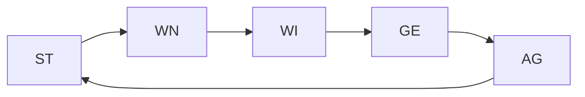

Eigenschaften steigen jede einzeln im Level, umso öfter sie verwendet werden. Für das Aufsteigen folgendes Vorgehen:
1. Für jeden Wurf wird bei der entsprechenden Eigenschaft aufgeschrieben, ob es $<20$ oder $>=20$ ist
2. Sobald die Anzahl der Erfolge ($>=20$) und Misserfolge ($<20$) gleich $Eigenschaftswert +2$ ist, steigt die Eigenschaft um 1

**Bsp.:** Vency steigert sein GE von 13 auf 14, sobald er 15 mal einen Erfolg und 15 mal einen Misserfolg gewürfelt hat
Pro Tag kann nur die Hälfte der benötigten Kreuze für das Aufleveln einer Eigenschaft gewonnen werden, der Rest verfällt

