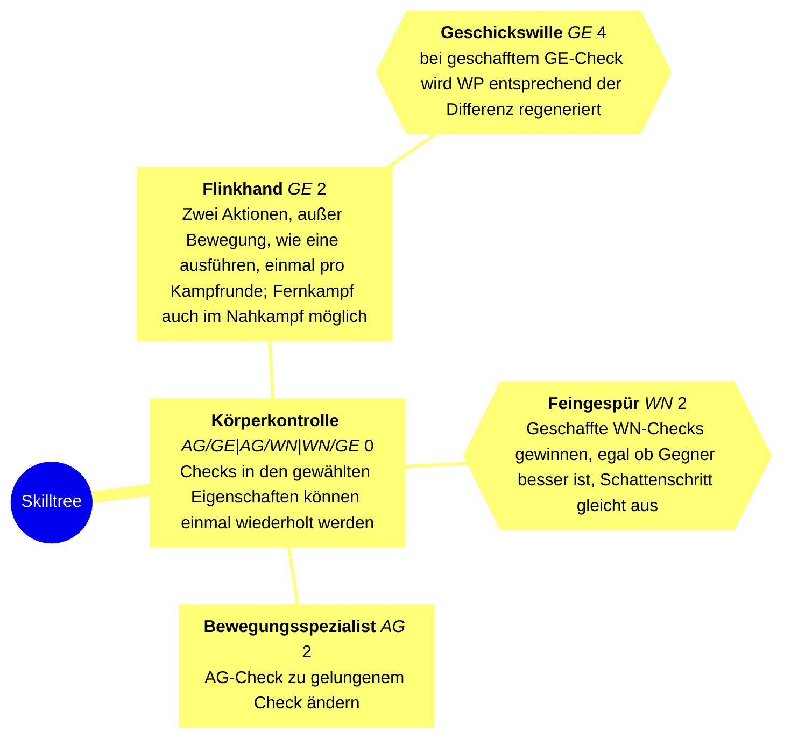
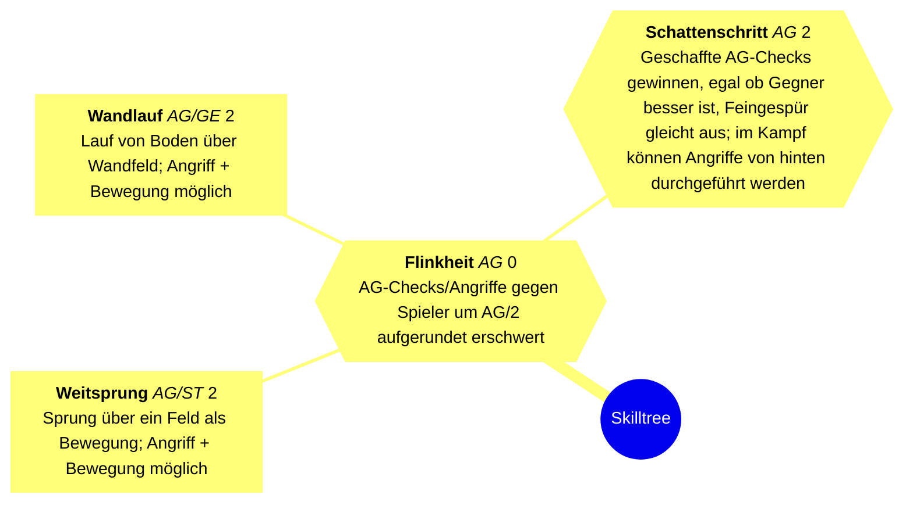
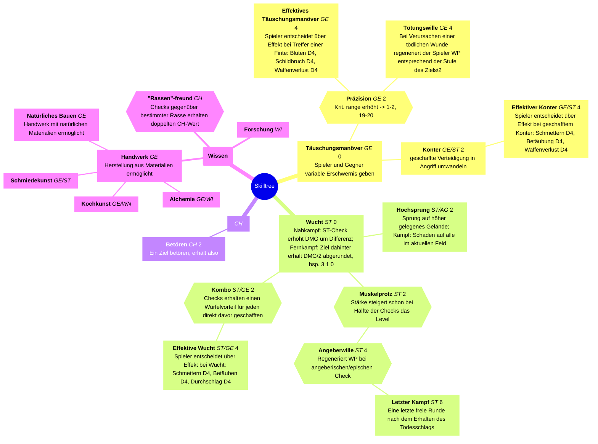
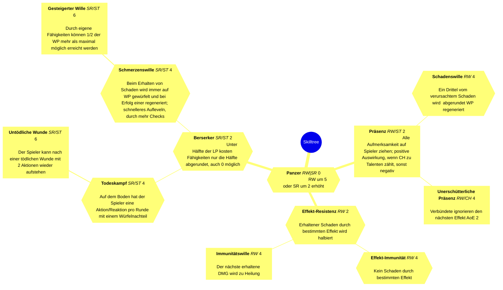

Aufgeteilt in Stufen. Um einen Skill der nächsten Stufe freizuschalten benötigt man entweder einen Skill der gleichen Eigenschaft eine Stufe darunter oder zwei mit unterschiedlichen Eigenschaften eine Stufe darunter.

